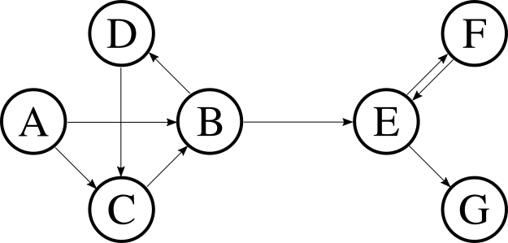

# observer.js
`observer.js` is a tiny Javascript library to adopt observer pattern in a project with minimal impact on existing codebase.
It allows transparent interaction between modules without the need to modify modules itself.

It tracks an execution state of observers to avoid infinite loop on cyclic configurations.

## Installation

Import lib with [Bower package manager](https://bower.io/):
```sh
bower install observer-js
```
or by download `dist/observer.min.js` and import in project with direct include

```html
<script src='observer.min.js'></script>
```
or with a module loader.

## How to use

All you have to do is declare a function as observable:
```js
var myObservedFun = (function() {}).observable();
```
or overwrite an existing reference to a function with observable version:
 ```js
myObj.myObservedFun = myObj.myObservedFun.observable();
 ```
Now you can set observers, also with a chaining notation:
```js
var firstObserver = function() { console.log('fistObserver execution!') };
var secondObserver = function() { console.log('secondObserver execution!') };

myObservedFun.addObserver(firstObserver)
             .addObserver(secondObserver);
```

Observers removal is supported. One by one:
```js
myObservedFun.removeObserver(firstObserver);
```
or all in one shot:
```js
myObservedFun.removeAllObservers();
```

That's all!

`observer.js` supports more complex situations: for an advance use check next sections.

## Options

`observer.js` supports complex configurations with conditional executions and parameters retrieval for observers. 


### Observer execution context
To bind observer execution to a context you can clearly pass the binded version: `.addObserver(myObserver.bind(myObj))`.

Otherwise you can set the execution context by a property, passing an object to `addObserver()` with `fn` and `context`.
```js
myObservedFun.addObserver({
    fn: myObserver,
    context: myObj
})
```
The first method is discouraged, especially if same function is used more than one time as observer because it may lead to a fail in state-checking.
This because `func != func.bind(context)` and, more important, `func.bind(context) != func.bind(context)`.

In a cyclic configuration of observers it can lead to an infinite loop.

### Conditional execution
Observers execution can be conditionated to conditions provided during observer binding.

To define conditions you have to pass an object to `addObserver()`, with observer function and conditions definition:
```js
myObservedFun.addObserver({
    fn: firstObserver,
    conditions: {} | Function
})
```
`conditions` can be set with an object or function (*single condition*) or an array (*multiple conditions*).

##### Single condition:
A single condition is defined in two ways:

###### Function
```js
myObservedFun.addObserver({
    fn: firstObserver,
    conditions: myFun
})
```
Value returned from execution is checked. The example corresponds to `if (myFun())`.

###### Object
with at least one parameter `firstParam` to be checked before execution:
```js
myObservedFun.addObserver({
    fn: firstObserver,
    conditions: { firstParam: 'nested.object.paramName' }
})
```
In general you can define a condition as a comparison of two parameters:
you have to set two parameters (`firstParam`, `secondParam`) and a comparison operator (`operator`).

As parameter you can set:
- value returned from observed: you have to set parameter to `OBS_OBSERVED_RETURNED`
- primitive value: you have to specify type attribute (`firstType` for `firstParam` or `secondType` for `secondParam`) as `OBS_PRIMITIVE`
- "*stringed*" reference of a variable (*dot-notation* is supported): if reference is not in global scope you have to specify it with `firstScope` or `secondScope`
- reference to a function

As operator you can optionally set: `"==="`, `"!=="`, `"=="`, `"!="`, `"<"`, `"<="`, `">"`, `">="`. Default value: `"=="`.

A condition with only one parameter (`firstParam`) will be checked by `if (firstParam)`.

All possible properties of condition object: `firstParam`, `secondParam`, `operator`, `firstType`, `secondType`, `firstScope`, `secondScope`

Example with value of variable `myObj.nestedObj.myVar` compared with value returned from `anotherObj.myFun` function:
```js
conditions: {
    firstParam: 'nestedObj.myVar',
    firstScope: myObj
    operator: '<=',
    secondParam: anotherObj.myFun
}
```

Example with value returned from observed function compared with `null` (primitive value):
```js
conditions: {
    firstParam: OBS_OBSERVED_RETURNED,
    operator: '===',
    secondParam: null,
    secondType: OBS_PRIMITIVE
}
```

##### Multiple conditions:
Boolean expressions to compare multiple single conditions is supported.

To use boolean operators you have to set `conditions` as array, where first element **is** one of `"AND"`, `"OR"`, `"NOT"`.
Subsequent elements can be single conditions or array itself (recursive). If operator is `"NOT"`, in the array can be only another element, the condition.

Example condition: `(A && B && (C || !D || E))` will be:

```js
conditions:  ["AND", A, B, ["OR", C, ["NOT", D], E]]
```

where `A`, ..., `E` are single condition objects defined like above.

### Parameters retrieval
It is possible to pass parameters to observers at execution time.

To define parameters you have to pass an object to `addObserver()`, with observer function and parameters definition:
```js
myObservedFun.addObserver({
    fn: firstObserver,
    params: []
})
```
`params` (optional) is an array with elements that will be passed to function.

Three types of objects in array:

- Function, executed to retrieve params
- Primitive values
- `OBS_OBSERVED_RETURNED` to pass value returned from observer

Example:
```js
params: [ getterFun, Math.PI, "name", OBS_OBSERVED_RETURNED, 42]
```
corresponds to: `observer(getterFun(), MathPi, "name", ret, 42)` where `ret = observed()`

## Cyclic configuration

Since observers can be in their turn observed it is possible to have a cyclic-graph configuration.
In this case loop is avoided by a mechanism of state-checking and observers execution is triggered via a dfs exploration of graph.

Configuration example:
```js
var a = (function() { }).observable();
var b = (function() { }).observable();
var c = (function() { }).observable();
var d = (function() { }).observable();
var e = (function() { }).observable();
var f = (function() { }).observable();
var g = (function() { }).observable();

a.addObserver(b).addObserver(c);
b.addObserver(d).addObserver(e);
c.addObserver(b);
d.addObserver(c);
e.addObserver(g).addObserver(f);
f.addObserver(e);
```
above configuration corresponds to:



In this case execution flows are:
```js
a(); // -> b(), d(), c(), e(), g(), f()
d(); // -> c(), b(), e(), g(), f()
f(); // -> e(), g()
```

In case of more observers on an observed, their execution occurss in order in which they were added.
 
## Note
`observer.js` save two variables in global scope: `OBS_OBSERVED_RETURNED` and `OBS_PRIMITIVE`